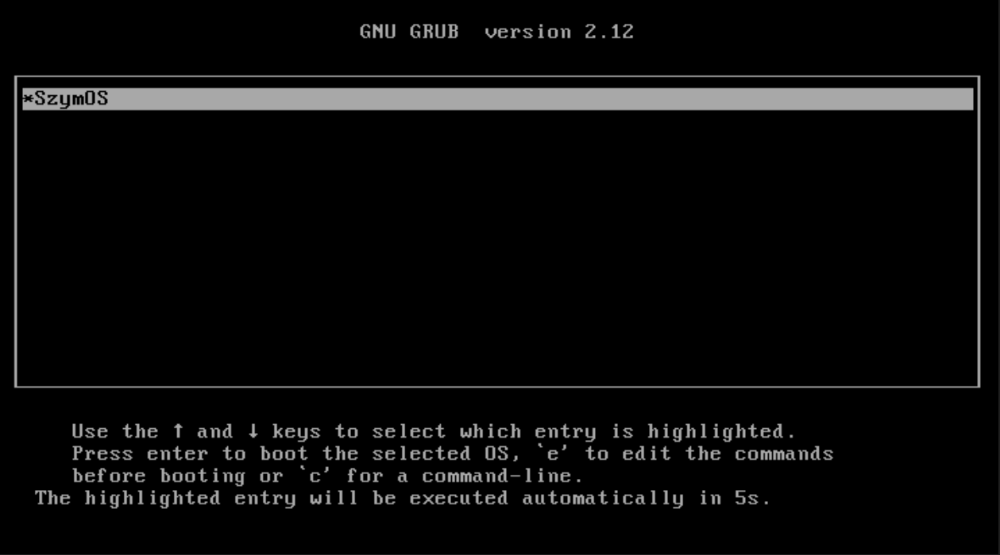
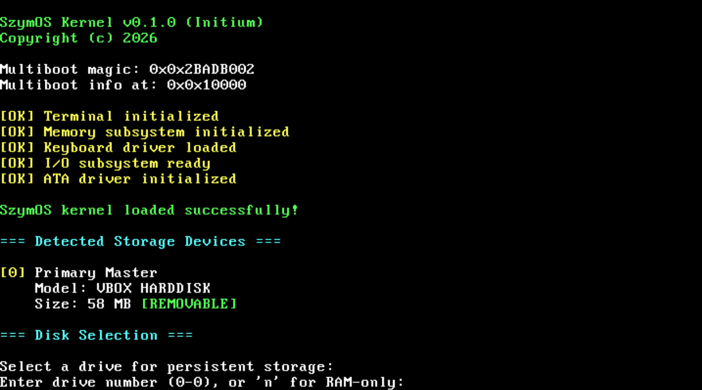
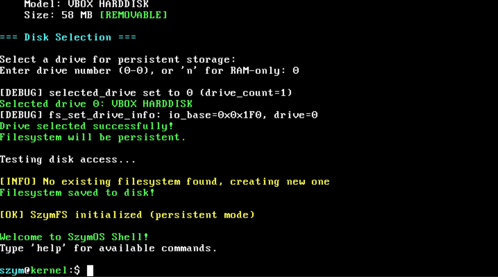
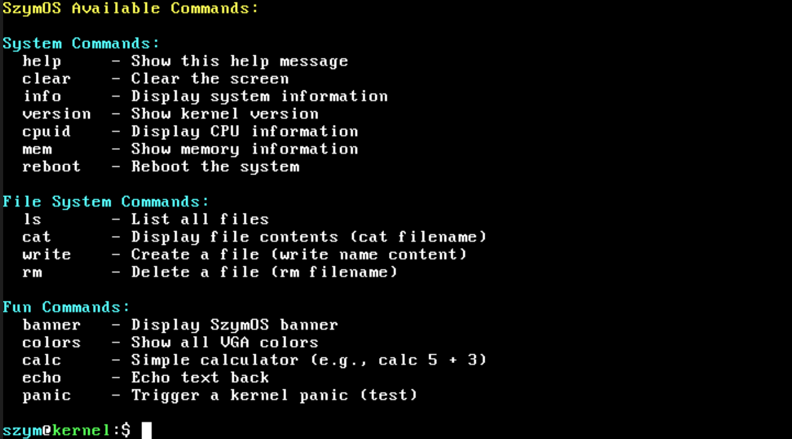
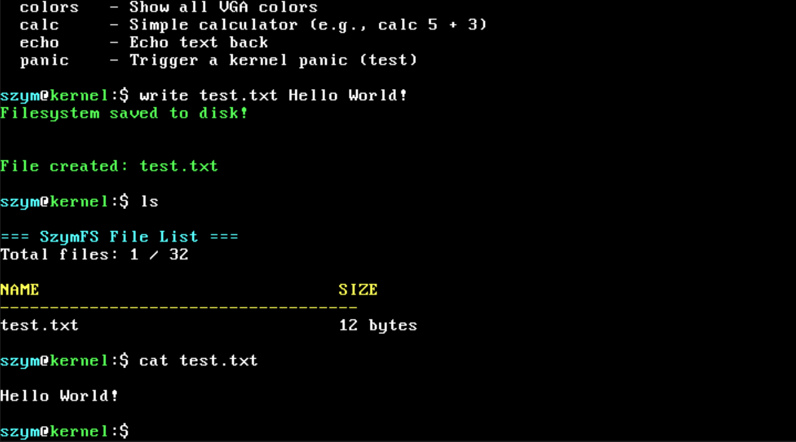
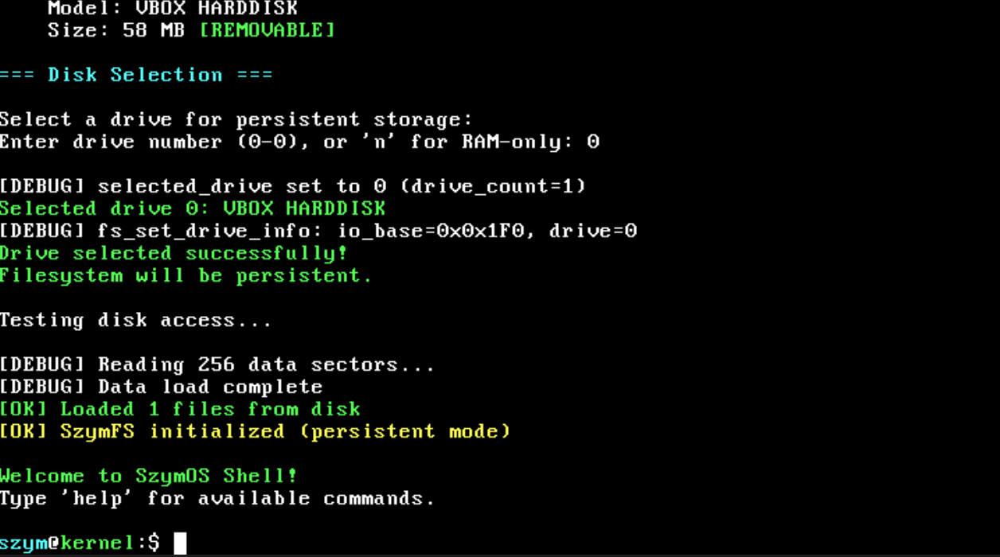
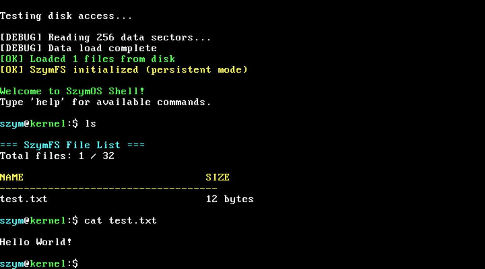
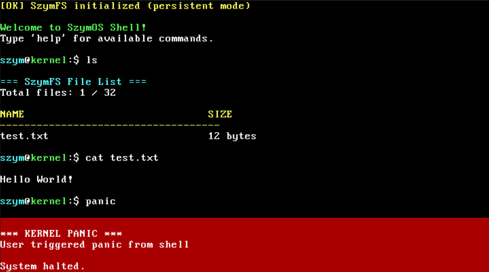

# SzymOS

```
 ____                      ___  ____  
/ ___|_____   _ _ __ ___  / _ \/ ___| 
\___ \_  / | | | '_ ` _ \| | | \___ \ 
 ___) / /| |_| | | | | | | |_| |___) |
|____/___|\__, |_| |_| |_|\___/|____/ 
          |___/                       
```


**SzymOS** is a custom operating system kernel built from scratch, focused on being **fast, clean, and extensible**.

This project is aimed at building a **serious low-level system** with real functionality, while keeping the codebase approachable enough for contributors to extend and improve.

---

## 🌟 Core Focus

* Performance and simplicity
* Clean, understandable architecture
* Real hardware support
* Expandable system design

---

## ✨ Features

* Bootable on real x86 hardware
* Persistent filesystem (SzymFS)
* Interactive shell with 25+ commands
* CPU, memory, and disk detection
* VGA text-mode interface (80x25)
* Keyboard driver (QWERTY + shift support)
* File operations (create, read, copy, move, delete)

---

## 🖥️ System Demonstration

### GRUB Bootloader


The system is loaded via GRUB, allowing boot selection and kernel entry.

---

### Kernel Boot


SzymOS initializes core subsystems including memory, VGA output, and input drivers.

---

### First Boot


Initial system state after first successful boot into the kernel shell.

---

### Command Interface


Interactive shell demonstrating core system commands and file operations.

---

### Saving Data to Disk


Files are written to persistent storage using SzymFS.

---

### System Reboot
At this stage, the system was rebooted to verify persistence.

---

### After Reboot


System state after reboot, confirming that data was retained.

---

### Persistent Storage Demonstration


Previously saved data is successfully reloaded from disk.

---

### Kernel Panic Demonstration


This kernel panic was intentionally triggered by executing the `panic` command to demonstrate system error handling and crash state output.

---

## 🚀 Quick Start

### Prerequisites

#### Ubuntu / Debian / WSL

```bash
sudo apt update
sudo apt install build-essential nasm grub-pc-bin xorriso qemu-system-x86 gcc-multilib
```

#### Arch Linux

```bash
sudo pacman -S base-devel nasm grub xorriso qemu-system-x86
```

### Build and Run

```bash
git clone https://github.com/yourusername/SzymOS-kernel.git
cd SzymOS-kernel

make clean
make
make run
```

---

## 🏗️ Project Structure

```text
SzymOS-kernel/
├── boot/        # Boot entry
├── kernel/      # Core kernel logic
├── include/     # Headers
├── linker.ld
├── grub.cfg
├── Makefile
└── README.md
```

---

## 🤝 Contributing

This project is open to contributors who want to **build real low-level systems**, not just experiment.

### Where You Can Help

#### 🟢 Entry-Level

* Improve documentation clarity
* Add or refine shell commands
* Fix bugs or edge cases

#### 🟡 Intermediate

* Extend filesystem functionality
* Improve hardware support
* Enhance shell capabilities

#### 🔴 Advanced

* Memory management
* Multitasking
* Driver development
* 64-bit support

---

## 🛠️ Workflow

```bash
git clone https://github.com/YOUR_USERNAME/SzymOS-kernel.git
cd SzymOS-kernel

git checkout -b feature/your-change

make clean
make run

git commit -m "Describe your change"
git push origin feature/your-change
```

Open a Pull Request once ready.

---

## 💡 Guidelines

* Keep code simple and readable
* Avoid unnecessary complexity
* Test changes before submitting
* Keep commits focused and clear

---

## 🐛 Current Limitations

* BIOS only (no UEFI)
* Limited SATA support
* Max file size: 4KB
* No directories yet
* No multitasking

---

## 🎯 Direction

SzymOS is being developed as a **clean, extensible kernel project** with the goal of evolving into a more complete operating system over time.

---

## 📜 License

MIT License

---

⭐ Star the project if you're interested in contributing or following its progress.

